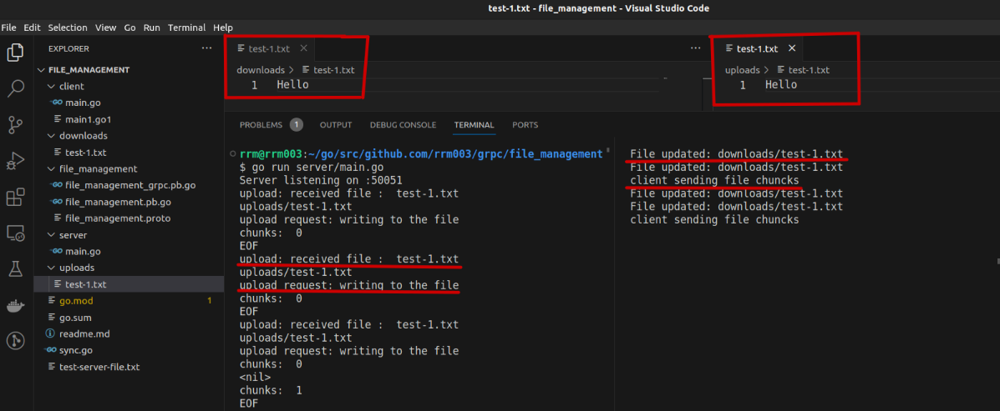

# distributed-file-service

A robust distributed system that provides file management services (upload, download, delete, rename) and real-time client-server synchronization using gRPC and Go. Includes computation services for basic operations like addition and sorting. Implements both synchronous and asynchronous communication patterns, leveraging Go's concurrency features.

Here's a README file in Markdown format based on your project report. It's structured and formatted for clarity and ease of copying:

---

# Distributed System Application

## Introduction

The objective of this project is to develop a robust **file management service** and a **computation service** using **remote procedure call (RPC)** based communication. The project focuses on:

-   File management techniques
-   Client-server communication
-   Asynchronous communication between client and server by implementing simple addition and sorting compute services

---

## Tools

-   **Programming Language**: Go
-   **Libraries**:
    -   `grpc`
    -   `sync`
    -   `fsnotify`
    -   `cobra`

---

## Implementation

### Part 1: File Management

Supports the following operations:

### 01. Start Server


### 02. Upload Operation


### 03. Download Operation


### 04. Rename Operation


### 05. Delete Operation


### Part 2: File Synchronization

Synchronizes client-side changes with the server.

---

### 01. Start both server and client.


### 02. Create a file at client's side, it gets created to server side and saved to downloads folder


### 03. Any update made to the client's side gets synced to respective file on the servers end.



### 04. File renamed on the client side is also renamed to server's end.


### 05. If file deteled on the clients side is also deleted from the server.


## Directory Structure

```
.
├── client
│   ├── main1.go
│   └── main.go
├── downloads
│   └── serverfile.txt
├── file_management
│   ├── file_management_grpc.pb.go
│   ├── file_management.pb.go
│   └── file_management.proto
├── go.mod
├── go.sum
├── server
│   └── main.go
├── sync.go
├── test-server-file.txt
├── uploads
│   └── serverfile.txt
```

---

## Learnings

### 1. gRPC

-   Implementing the project using **gRPC** provided valuable insights into modern RPC frameworks.
-   Key concepts learned:
    -   Service definition using **Protocol Buffers**.

### 2. Concurrency

-   Explored Go's concurrency model using **goroutines**.
-   Learned about lightweight thread management and idiomatic patterns for concurrent programming.

### 3. File Operations

-   Used the **fsnotify** package for tracking file operations.
-   Gained experience with event-driven programming paradigms.
-   Practiced efficient file handling using Go's standard library.

### 4. Synchronous and Asynchronous APIs

-   Implemented both **sync** and **async** APIs using Go's concurrency features.
-   Designed efficient and responsive APIs by leveraging:
    -   **Goroutines**
    -   **Channels**
